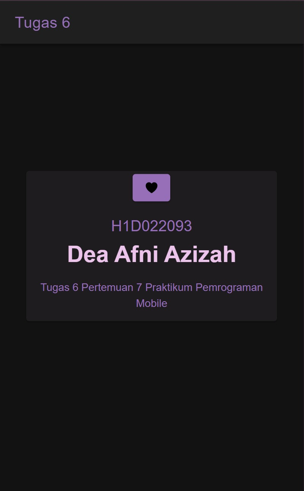

Nama : Dea Afni Azizah

NIM : H1D022093

Shift Baru: C

## PENJELASAN
Langkah 1: Mempersiapkan Proyek Ionic
1.	Buat Proyek Ionic Baru di terminal
```
ionic start tugas6
```   
2.	Buka folder tugas6 pada VSCode, lalu buka terminal dan ketikkan
   ```
ionic serve
```

Langkah 2: Menambahkan Komponen ke Halaman
1.	Buka File home.page.html untuk menambahkan komponen.
2.	Tambahkan komponen yang diinginkan ke dalam file HTML. 
   ```
      <ion-card>
        <ion-button aria-label="Favorite" id="click-trigger">
          <ion-icon name="heart" aria-hidden="true"></ion-icon>
        </ion-button>
        <ion-popover trigger="click-trigger" triggerAction="click">
          <ng-template>
            <ion-content class="ion-padding">Hello!</ion-content>
          </ng-template>
        </ion-popover>
        <ion-card-header>
          <ion-card-title>H1D022093</ion-card-title>
          <ion-card-subtitle><b>Dea Afni Azizah</b></ion-card-subtitle>
        </ion-card-header>

        <ion-card-content>
          Tugas 6 Pertemuan 7 Praktikum Pemrograman Mobile
        </ion-card-content>
      </ion-card>
   ```
  a. ion-card	: Menambahkan komponen Card pada halaman  
  b. ion-button	: Menambahkan komponen button atau tombol  
  c. ion-popover	: Menambahkan pesan singkat saat tombol ditekan  
  d. ion-card-header	: Menambahkan header atau kepala pada Card  
  e. ion-card-title	: Menambahkan judul untuk Card  
  f. ion-card-subtitle	: Menambahkan subjudul untuk Card  
  g. ion-card-content	: Menambahkan isi konten pada Card

Langkah 3: Styling Komponen
1.	Buka file home.page.scss.
2.	Tambahkan Styling sesuai kebutuhan. Berikut adalah styling yang ditambahkan untuk mempercantik halaman.
   ```
#card {
  max-width: 350px;
  margin: 0 auto;
}

ion-card {
  --background: #1f1c20;
  --color: #966fb8;
}

ion-card-title {
  --color: #966fb8;
  font-size: 20px;
}

ion-card-subtitle {
  --color: #ebc3eb;
  font-size: 30px;
}

ion-title {
  --color: #966fb8;
}

ion-button {
  --background: #966fb8;
}
```

Langkah 4: Menjalankan Aplikasi
Setelah menambahkan komponen dan styling, file yang disimpan akan segera menampilkan perubahannya di halaman aplikasi yang sudah dijalankan sebelumnya.

Screenshot tampilan:


